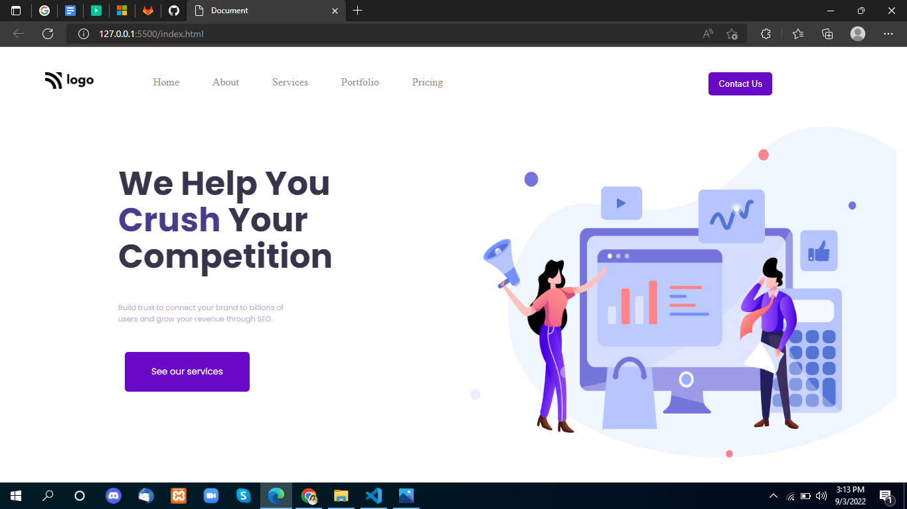

# Project-4

 

## Project live link
[https://my-project-04.netlify.app/](https://my-project-04.netlify.app/ "project04")

## Screenshot

 

## project Type
- UI Design
- One Page Website

## My learning from this Project
- Navigation Designing
- How to design HTML Code
- Flex Box & Flex Derection 
- Image Fixing

## Time to make this project
#### Approx 3 hour to make
